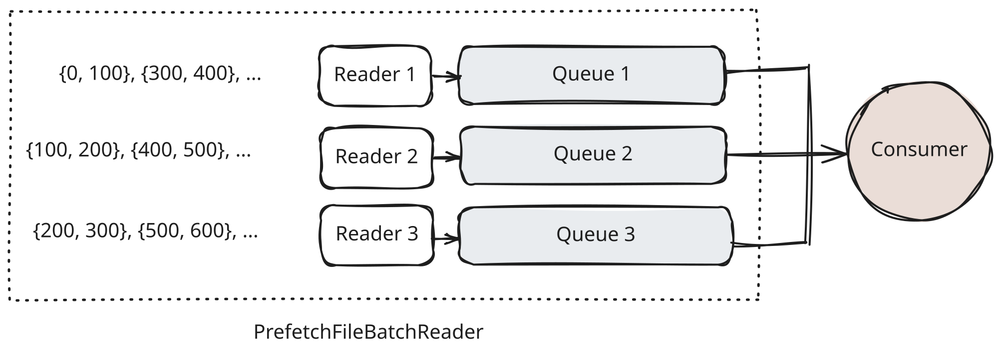

.. Licensed to the Apache Software Foundation (ASF) under one
.. or more contributor license agreements.  See the NOTICE file
.. distributed with this work for additional information
.. regarding copyright ownership.  The ASF licenses this file
.. to you under the Apache License, Version 2.0 (the
.. "License"); you may not use this file except in compliance
.. with the License.  You may obtain a copy of the License at

..   http://www.apache.org/licenses/LICENSE-2.0

.. Unless required by applicable law or agreed to in writing,
.. software distributed under the License is distributed on an
.. "AS IS" BASIS, WITHOUT WARRANTIES OR CONDITIONS OF ANY
.. KIND, either express or implied.  See the License for the
.. specific language governing permissions and limitations
.. under the License.

Prefetch
========

In Paimon C++, we use a multi-producer, single-consumer model to optimize file
reading. The core idea is to split a file into row-based read ranges and assign
them to multiple reader threads (producers). Each reader thread owns an
independent result queue that holds its processed RecordBatches. In the main
reader thread (the consumer), we sort the heads of all queues by the read
range's starting row and select the RecordBatch with the smallest starting row
to ensure globally ordered results.

Read Range Splitting Strategy
=============================

Designing an efficient ReadRange splitting strategy requires balancing two key
objectives:

- Minimize read amplification: Ensure the data fetched from storage is used
  effectively, avoiding unnecessary I/O overhead.
- Reduce ReadRange span: Ideally, the size of a ReadRange should match a single
  read batch size to enable fine-grained parallel control.

Below we detail how these strategies are applied to Parquet and ORC.

Parquet
========

Parquet files are organized into RowGroups and Pages. Since C++ Parquet does
not support row-level seeking, prefetching can only be done at the RowGroup
level. This naturally avoids read amplification, but introduces a new
challenge: if a file contains only a small number of RowGroups, parallelism is
severely limited. Therefore, we recommend users reduce RowGroup size when
writing Parquet files to increase opportunities for parallel processing.

Another critical difference is the read behavior compared to ORC. ORC strictly
returns RecordBatches aligned to Stripe boundaries, whereas C++ Parquet may
return a RecordBatch containing data from multiple RowGroups. This can lead to
output order confusion during parallel reads. We modified C++ Parquet internals
to return results strictly aligned to RowGroup boundaries, matching ORC's
behavior. With this change, parallel reading no longer requires complex seek
operations, improving overall read efficiency.

ORC
===

ORC files are organized into Stripes. Paimon C++ generates row ranges from
Stripe metadata, the selected columns, and the configured natural read size.
Prefetch is enabled when the estimated compressed size of the selected columns
exceeds the configured threshold; otherwise the reader uses the normal
single-reader path.

Warmup
======

Prefetching parallelizes the reads inside one file. When the data files of a
split are read one after another, warmup also overlaps the files with each
other: while one file is being consumed, the reader already starts the first
read of the next one, instead of waiting until the current file reaches its
end. Warmup looks one file ahead of the file being read, and merge-on-read with
the default ``loser-tree`` sort engine additionally warms the first file of
every sorted run before merging. It applies to append-table reads and append
compaction as well, but does not cross split boundaries.

How far the next file is prepared is set with
``ReadContextBuilder::SetWarmupLevel()``. Append compaction builds its own read
context and always uses the default level.

- ``WarmupLevel::NONE``: do not warm up.
- ``WarmupLevel::RAW`` (default): fetch the next file's raw bytes through the
  read-ahead cache without decoding them. It has no effect when the read-ahead
  cache is disabled with ``ReadContextBuilder::SetReadAheadCacheEnabled()``.
- ``WarmupLevel::DECODED``: also start decoding the next file, which hides the
  most latency but uses the most memory.

Warmup goes through the prefetch reader, so it only applies to Parquet and ORC
files that are actually read with prefetching, and enabling prefetch alone does
not guarantee that. With the adaptive strategy, a file whose first read range
holds more batches than one prefetch queue can buffer is read without
prefetching, and so without warmup; the ``prefetch.adaptive-disabled-count``
metric counts how often this happens. Append compaction uses a prefetch queue
of three batches, so it only warms files whose first read range spans no more
than three full batches, such as files with small row groups.

``WarmupLevel::RAW`` issues its fetches from the reading thread through the
file system's asynchronous read, so it only overlaps I/O when that read is
really asynchronous. The local file system serves it synchronously, so there
``RAW`` warmup reads the next file on the reading thread before the current
batch is returned, adding latency instead of hiding it. On such file systems,
prefer ``WarmupLevel::DECODED``, which fetches on the background decode thread,
or ``WarmupLevel::NONE``.

Warmup preserves the returned rows and their order, but it costs memory: under
``WarmupLevel::RAW`` the next file may hold up to the read-ahead cache's
pre-buffer limit (256 MiB by default, see ``CacheConfig::SetPreBufferLimit()``)
on top of the file being read. It may also fetch data from a file that the
reader never consumes: a read that stops early, for example because of a LIMIT,
may already have warmed the next file, and closing it waits for that file's
in-flight fetches.
