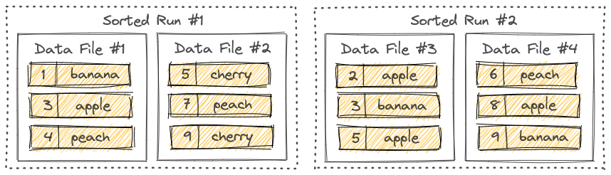

.. Licensed to the Apache Software Foundation (ASF) under one
.. or more contributor license agreements.  See the NOTICE file
.. distributed with this work for additional information
.. regarding copyright ownership.  The ASF licenses this file
.. to you under the Apache License, Version 2.0 (the
.. "License"); you may not use this file except in compliance
.. with the License.  You may obtain a copy of the License at

..   http://www.apache.org/licenses/LICENSE-2.0

.. Unless required by applicable law or agreed to in writing,
.. software distributed under the License is distributed on an
.. "AS IS" BASIS, WITHOUT WARRANTIES OR CONDITIONS OF ANY
.. KIND, either express or implied.  See the License for the
.. specific language governing permissions and limitations
.. under the License.

.. Ported from the Paimon documentation:
.. https://github.com/apache/paimon/blob/master/docs/content/primary-key-table/overview.md

Primary Key Table
=================
If you define a table with primary key, you can insert, update or delete records
in the table.

Primary keys consist of a set of columns that contain unique values for each
record. Paimon enforces data ordering by sorting the primary key within each
bucket, allowing users to achieve high performance by applying filtering
conditions on the primary key.

Bucket
-------
Unpartitioned tables, or partitions in partitioned tables, are sub-divided into
buckets, to provide extra structure to the data that may be used for more
efficient querying.

Each bucket directory contains an LSM tree and its changelog files.

.. note::
   Changelog is not supported yet for Paimon C++ primary key table write.

The range for a bucket is determined by the hash value of one or more columns in
the records. Users can specify bucketing columns by providing the bucket-key option.
If no bucket-key option is specified, the primary key (if defined) or the complete
record will be used as the bucket key.

A bucket is the smallest storage unit for reads and writes, so the number of
buckets limits the maximum processing parallelism. This number should not be too
big, though, as it will result in lots of small files and low read performance.
In general, the recommended data size in each bucket is about 200MB - 1GB.

Also, see rescale bucket if you want to adjust the number of buckets after a
table is created.

LSM Trees
-------------
Paimon adopts the LSM tree (log-structured merge-tree) as the data structure for
file storage. This documentation briefly introduces the concepts about LSM trees.

Sorted Runs
~~~~~~~~~~~~~~
LSM tree organizes files into several sorted runs. A sorted run consists of one
or multiple data files and each data file belongs to exactly one sorted run.

Records within a data file are sorted by their primary keys. Within a sorted run,
ranges of primary keys of data files never overlap.

As you can see, different sorted runs may have overlapped primary key ranges,
and may even contain the same primary key. When querying the LSM tree, all
sorted runs must be combined and all records with the same primary key must be
merged according to the user-specified merge engine and the timestamp of each record.

New records written into the LSM tree will be first buffered in memory. When the
memory buffer is full, all records in memory will be sorted and flushed to disk.
A new sorted run is now created.

.. _primary-key-managed-blob:

Managed BLOB Storage
--------------------
A primary-key table may define top-level ``BLOB`` columns. Their payload bytes
are table-managed: they never enter the merge-tree write buffer or the data
files. Unlike ``BLOB`` columns in append tables, primary-key managed BLOB
storage does not require ``row-tracking.enabled`` or
``data-evolution.enabled`` — a row-tracking table cannot define primary keys
in the first place. When a row is written, each non-null blob value is copied into a pack
file named ``data-<uuid>-<n>.managed.blob`` in the bucket directory, and the
row stores only a small descriptor (pack path, offset, length) in its place.
A pack is sealed once it reaches ``blob.target-file-size``; the copy uses a
``blob.copy-buffer-size`` buffer (default ``4 kb``, must be between 1 byte and
2147483647 bytes). Retract rows (``DELETE`` / ``UPDATE_BEFORE``) never keep a
payload; their blob value becomes NULL.

Reads resolve the descriptors back to payload bytes with one ranged read per
value, after merging, so only surviving rows ever fetch their payloads. Set
``blob-as-descriptor`` to ``true`` to receive the serialized descriptors
instead.

Every data file carries a ``.blobref`` sidecar in its extra files, listing the
pack files its rows reference. Compaction rewrites descriptors verbatim —
payloads are never copied again — and rebuilds the sidecar so it lists exactly
the packs the surviving rows still reference. The sidecar is removed wherever
its data file is removed with its companion files; a pack file may be shared
by several data files and is never deleted by table maintenance (orphan file
clean skips ``.managed.blob`` files).

.. note::
   Snapshot expiration removes a ``.blobref`` sidecar together with its
   expired data file, and an aborted writer cleans up its own sidecars. A
   sidecar left behind by an abandoned uncommitted write or a failed commit
   (e.g. a crashed process), however, is only removed once the orphan files
   cleaner supports primary-key tables.

Restrictions:

- Only top-level scalar ``BLOB`` columns are managed. ``ARRAY<BLOB>`` and
  ``MAP<K, BLOB>`` fields, which Paimon Java also externalizes, are not
  supported yet.
- ``blob-descriptor.source-table`` (re-materializing descriptors through the
  source table's credentials) is not supported: configuring it fails schema
  validation, and descriptors are always read and copied through the table's
  own file system.
- ``pk-clustering-override`` set to ``true`` is not supported; an explicit
  ``false`` is accepted.
- Only the ``deduplicate``, ``partial-update`` and ``first-row`` merge engines
  are supported, and ``changelog-producer`` must stay ``none``.
- A managed ``BLOB`` column cannot be a primary key, bucket key, sequence
  field or partition key, and the table needs at least one other normal
  column.
- A ``BLOB`` column cannot order a partial-update sequence group, and a
  sequence-group-protected managed ``BLOB`` field only supports no aggregate
  function, ``last_value``, or ``fields.<field>.ignore-retract`` set to
  ``true`` (retract rows do not retain the payload).
- ``data-file.external-paths`` is not supported.
- ``blob-descriptor-field`` / ``blob-view-field`` columns are inline blob
  fields: they keep caller-provided bytes in the data files and are not
  table-managed.
